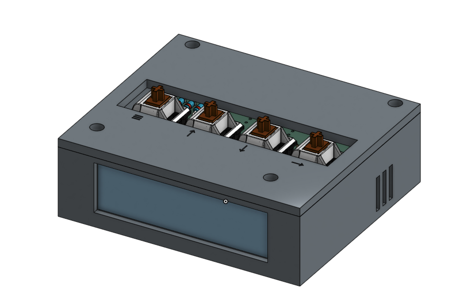
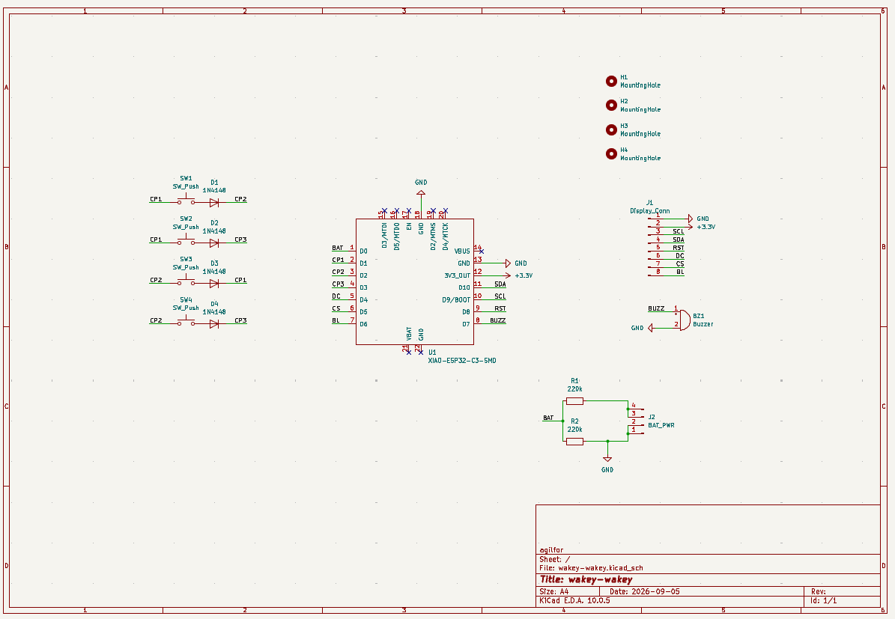
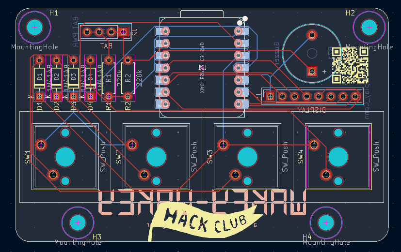
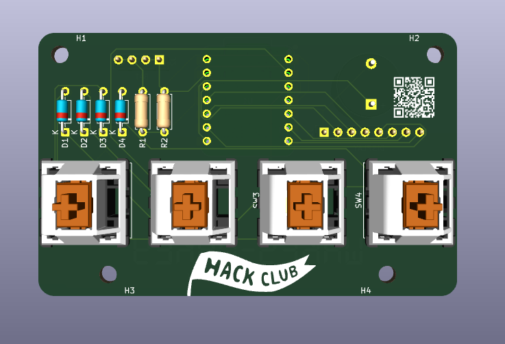
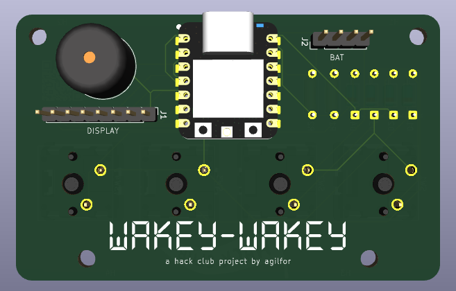

# wakey-wakey

wakey-wakey is a simple alarm clock built on a Seeed Studio XIAO ESP32C3. It runs on C++.

## Features

- TFT Display
- 4 buttons
- Battery or USB-C power
- Deep sleep
- Buzzer
- Alarms (WIP)
- Wi-Fi config (WIP)
- Wi-Fi time sync (WIP)

## CAD

The goal of this model was to make it as symmetrical as possible and as minimalistic as possible. The idea is for it to look simple and be functional as an alarm clock should be.

The current design was made in Onshape. It has screwholes for the PCB, a slot for the TFT display, holes for the buzzer sound, a gap for a USB-C cable, and a top cover with the functions of the buttons engraved.

## PCB

My PCB was made in KiCad. I went a bit more crazy with this than with the CAD, so it took a while. It has 4 keys Charlieplexed to 3 pins, a buzzer, and a TFT display with all pins connected. Additionally, it has been designed with battery functionality in mind. It has a pin header to connect a battery cell to the ESP32C3 VBAT and GND pins (requires some soldering), and uses a nifty voltage divider (with two 220kΩ resistors) connected to an analog pin to allow for battery level measurements. Though these parts fall outside of the standard kit, I have them at home so decided to add them because it's cool and because why not ¯\\\_(ツ)\_/¯

This is my current schematic. It uses charlieplexing to wire the keys (which is how I made space for the battery pin). The downside is it means I need to write more firmware to make it work. Other than that it's not very complicated. There are technically some wires missing (VBAT, GND, and the whole BAT_PWR block) as those require soldering. [More info about the battery trick](https://forum.seeedstudio.com/t/battery-voltage-monitor-and-ad-conversion-for-xiao-esp32c/267535).

This is my PCB. The routing wasn't particularly difficult, but I had fun with it. I mostly ended up making life difficult for myself by trying to make it as small as possible. Also, I spent way too long on the silkscreen designs but no regrets :)

### Wiring/Soldering

Due to the mount style of the XIAO ESP32C3, it is not possible to easily connect the battery pads under the microcontroller to the PCB (technically this is possible using a SMD mount, but it is a pain and much simpler to do some soldering with a DIP mount). The 4 pin male header is the connection of the battery to the microcontroller. It has 4 pins as it requires two pins for VCC and two for GND (connection to the battery cell and connection to the microcontroller). 

## Firmware Overview

The wakey-wakey uses C++ firmware for everything. Currently it supports deep sleep and waking on button press. It should also be able to draw to the TFT display.

Support still needs to be added for all the Wi-Fi functionalities, as well as the alarm, 24H time view toggle, and more. This will be done post-assembly, as some testing needs to be done with the charlieplexed keys before making the script more complicated than it already is.

There will probably be more changes as well to the firmware after all this, but that remains TBD.

## BOM

- 1x Seeed Studio XIAO ESP32C3
- 4x Cherry MX switches
- 4x White blank DSA keycaps
- 1x 2.25in TFT Display
- 1x 3.3V Piezo buzzer
- 1x 2.54mm 8 pin male header
- 8x 20cm female-female jumper wires
- 4x Through-hole 1N4148 Diodes
- 8x M3x5x4 Heatset inserts
- 4x M3x8mm Screws
- 4x M3x16mm Screws

Extra:

- 2x 220kΩ resistors
- 1x 4 pin male header
- LIR2450 battery cell 
- LIR2450 battery holder
